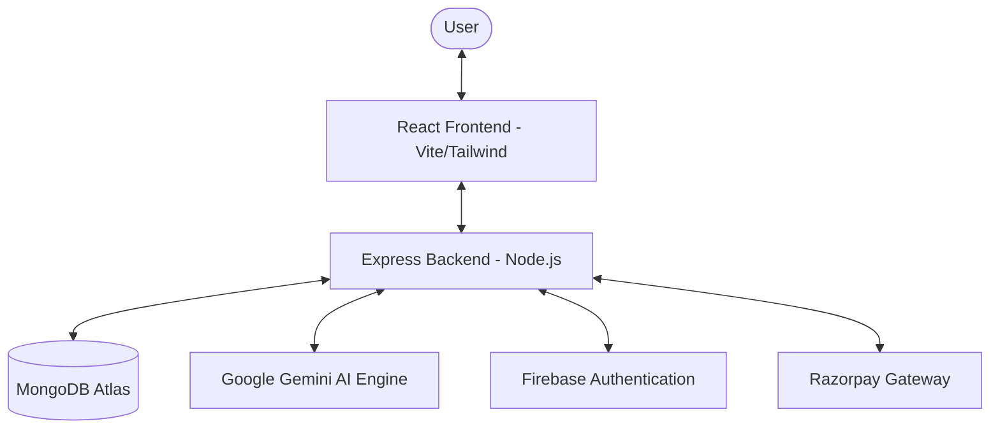
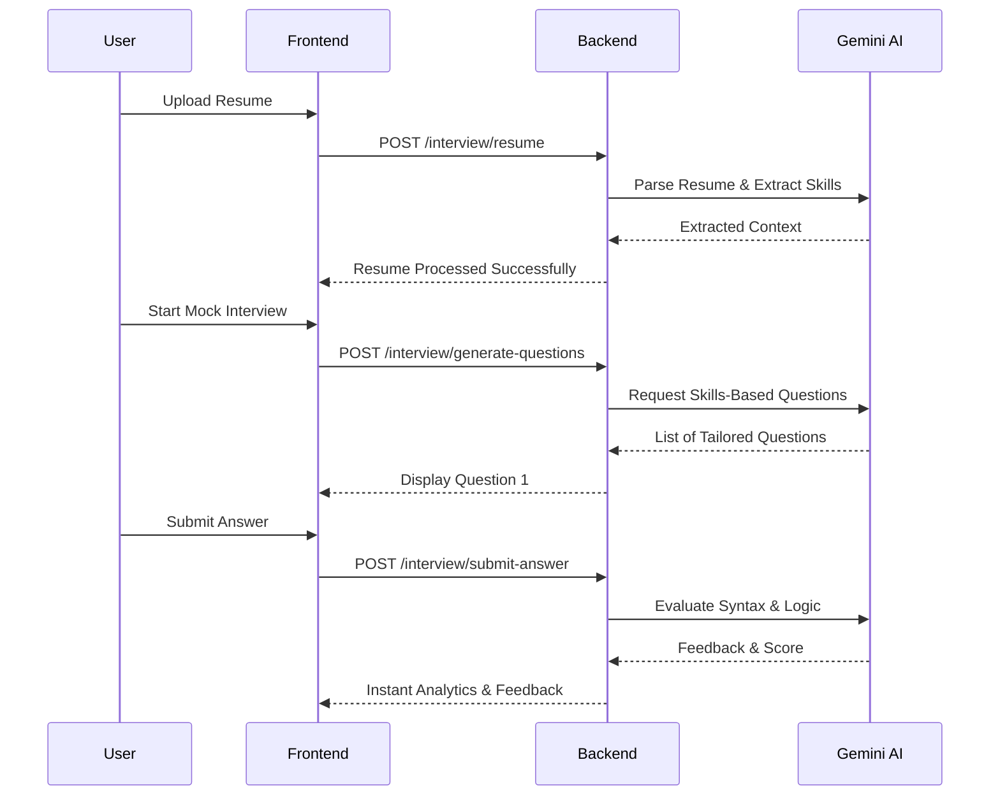

# InterviewIQ - Comprehensive AI-Driven Interview Preparation Platform

## Table of Contents
1. [Introduction](#1-introduction)
2. [Literature Survey](#2-literature-survey)
3. [Requirement Analysis](#3-requirement-analysis)
4. [Project Planning](#4-project-planning)
5. [System Design](#5-system-design)
6. [System Testing](#6-system-testing)
7. [Implementation](#7-implementation)
8. [Screenshots of Project](#8-screenshots-of-project)
9. [Conclusion And Future Scope](#9-conclusion-and-future-scope)
10. [References](#10-references)

---

## 1 Introduction

The modern job market has become increasingly competitive, creating a scenario where technical skills alone are often insufficient to secure high-value positions. Candidates frequently struggle with the "interview barrier"—a combination of psychological pressure, lack of structured feedback, and the inability to articulate their experiences effectively under stress. **InterviewIQ** is an advanced, AI-integrated platform designed to serve as a comprehensive preparation hub. Its primary objective is to democratize high-quality interview coaching using the power of Large Language Models (LLMs). By providing a simulated environment that mimics real-world corporate interviews, the platform allows users to practice in a low-stakes setting while receiving high-stakes feedback.

### 1.1 Purpose
The purpose of this project is to provide a seamless, end-to-end experience where a user can transition from a passive job seeker to an interview-ready professional. The scope of the project is expansive, covering intelligent resume parsing, dynamic question generation based on specific job descriptions or extracted skills, and detailed sentiment and technical accuracy analysis of user responses. Unlike traditional static question banks, InterviewIQ adapts to the user's specific career trajectory, ensuring that the preparation is always relevant.

---

## 2 Literature Survey

The literature survey for InterviewIQ involved a deep dive into the current landscape of EdTech and Recruitment-Tech (RecTech) platforms. Traditional solutions typically fall into two categories: static practice platforms which focus purely on technical syntax, and peer-to-peer mock interview platforms which rely on the availability and quality of another human participant. While these are valuable, they often lack the "expert" consistency that an AI can provide. Recent advancements in Generative AI, specifically through models like Google’s Gemini, have opened new avenues for "Intelligent Tutoring Systems" (ITS). These systems can maintain a context-aware conversation, making them ideal for simulated interviews.

### 2.1 System Review
System reviews indicate that candidates often feel more comfortable receiving initial critical feedback from an AI rather than a human, as it reduces social anxiety. The technology used in InterviewIQ is carefully selected to support this high-interactivity model. The MERN Stack (MongoDB, Express, React, Node.js) remains the industry standard for scalable web applications due to its unified JavaScript ecosystem. By integrating Google Gemini AI, the system gains the ability to reason over complex technical topics and provide feedback that feels collaborative rather than just corrective.

---

## 3 Requirement Analysis

Requirement analysis is a foundational step in ensuring the stability and performance of InterviewIQ. From a programming perspective, JavaScript (ESM) was chosen as the primary language for both the frontend and backend. This "JavaScript Everywhere" philosophy allows for faster development cycles and a more cohesive architectural vision. On the frontend, React 19 is utilized for its improved hooks and concurrent rendering capabilities, which are essential for maintaining a smooth UI during heavy AI processing tasks. The styling is managed via Tailwind CSS v4, which utilizes a CSS-first configuration to ensure the application remains lightweight.

The operating system requirements are designed to be cross-platform, capable of running on any environment that supports Node.js 20+. Hardware requirements are also a critical consideration. While the backend resides in the cloud, the client-side requires a modern processor and at least 4GB of RAM to handle the rendering of charts, animations, and the AI communication layer. More importantly, the hardware requirement extends to peripheral devices; a functional microphone and camera are prerequisites for the upcoming voice-integration features.

---

## 4 Project Planning

### 4.1 System Model
The system architecture follows a modern **Decoupled Architecture**, ensuring high availability and scalability. Below is the architectural representation:



Project planning for InterviewIQ followed a hybrid Agile-Scrum methodology, allowing for iterative development while maintaining a clear long-term roadmap. The project was divided into several key phases: Research and Architecture Design, Core API Development, AI Integration, Frontend Styling and Dashboards, and finally, Testing and Deployment. During the initial system model phase, it was decided to use a Modular Micro-Architecture. This means that the AI evaluation engine, the payment gateway, and the user management system are decoupled.

---

## 5 System Design

### 5.1 Use Case Model
The system design revolves around providing a high-availability, responsive architecture. The Use Case Model identifies three primary paths:
1. **Onboarding Path**: Registration, Firebase Auth, and Resume Upload.
2. **Preparation Path**: Mock Interview Execution and Real-time AI Feedback.
3. **Analytics Path**: Detailed Performance Reviews and Career Roadmaps.

### 5.2 Activity Diagram
The following diagram illustrates the user flow through the AI Interview cycle:



---

## 6 System Testing

System testing is conducted using a multi-layered approach to ensure reliability. The test cases for InterviewIQ are divided into Functional, Performance, and Edge-Case scenarios. Functional testing ensures that every button, API route, and database update works exactly as intended. For example, a critical test case involves verifying that the Razorpay webhook correctly updates the user's "Premium" status in MongoDB upon a successful transaction.

Testing results indicate that by optimizing the system's prompt engineering and using the Express-native streaming capabilities, we can maintain a responsive feel even during peak usage. Edge-Case testing is perhaps the most intensive part of the process. How does the system behave if a user uploads a blank PDF? What happens if the internet disconnects mid-interview? The system is designed with robust error-handling mechanisms that "Store and Resume" the state, ensuring that user progress is never lost.

---

## 7 Implementation

### 7.1 Work Flow
The implementation of InterviewIQ is a testament to the power of modern full-stack development and Generative AI. The workflow is built on a "Stateless REST API" model, where every request from the React client contains the necessary JWT token to identify the user and maintain session integrity. The server acts as an intelligent orchestrator, enriching user data with historical context before sending it to the Gemini engine.

### 7.2 Source Code & Folder Structure
The project is organized into a clean, modular structure following industry best practices:

```text
interviewIQ/
├── client/                 # React Frontend (Vite)
│   ├── public/             # Static Assets
│   └── src/
│       ├── assets/         # Images and Icons
│       ├── components/     # Reusable UI Components
│       ├── pages/          # Full Page Views
│       ├── redux/          # State Management (Slices)
│       ├── utils/          # Helper Functions (Firebase, API)
│       └── App.jsx         # Main Application Entry
├── server/                 # Node.js Backend (Express)
│   ├── config/             # DB and API Configurations
│   ├── controllers/        # Business Logic / Route Handlers
│   ├── middlewares/        # Auth and Upload Middlewares
│   ├── models/             # Mongoose Data Models
│   ├── routes/             # REST Endpoints
│   ├── services/           # Service Layer (AI Integration)
│   ├── uploads/            # Temporary File Storage
│   └── index.js            # Server Entry Point
├── README.md               # Project Documentation
└── .gitignore              # Dependency Management
```

---

## 8 Screenshots of Project

*(Insert your project screenshots here)*

- **The Command Center (Dashboard)**: A sleek, dark-mode interface presenting a high-level overview of the user's Readiness Score and recent history.
- **The AI Interview Room**: A focused, distraction-free interface where questions appear in a clean typography style.
- **Detailed Performance Analytics**: Visualizing scoring across categories: Technical Accuracy, Communication, and Confidence using Recharts.

---

## 9 Conclusion And Future Scope

In conclusion, **InterviewIQ** represents a significant step forward in the application of AI within the recruitment landscape. By combining the flexibility of the MERN stack with the reasoning capabilities of Google Gemini, the platform provides a solution that is both technically sophisticated and deeply practical.

**Future Scope**:
- **Voice-based AI Interviews**: Using Speech-to-Text and Tone Analysis.
- **Video Sentiment Analysis**: Monitoring body language and eye contact via camera.
- **Direct Job Matching**: Sharing reports directly with partner recruitment agencies.

---

## 10 References
- [React Documentation](https://react.dev/)
- [Express.js Documentation](https://expressjs.com/)
- [Google Gemini API Docs](https://ai.google.dev/)
- [MongoDB Atlas docs](https://www.mongodb.com/docs/atlas/)
